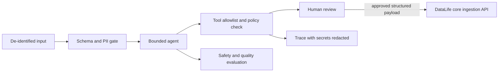

# DataLife Clinical Agents

> Safety-bounded clinical intake and workflow-agent research for DataLife e-Health.

[](LICENSE)
[](#project-status)
[](CONTRIBUTING.md)

`datalife-clinical-agents` is the planned experimentation and orchestration layer
for structured patient intake, de-identified summarization, and deterministic
workflow adapters in the [DataLife e-Health](https://github.com/datalife-ehealth)
ecosystem. It is designed around human review, least-privilege tools, explicit data
contracts, and complete traceability.

> [!CAUTION]
> This repository currently contains a project contract and community scaffold, not
> a runnable agent. It is not a medical device, does not provide medical advice, and
> must not autonomously diagnose, triage, prescribe, or make care decisions.

## Project status

**Scaffold / research lead wanted.** Agent code, model providers, and orchestration
frameworks have not been selected. Proposals should start with a threat model,
evaluation plan, and a narrow workflow rather than a general-purpose medical agent.

## Scope

### Candidate capabilities

- guided intake that converts patient-provided observations into a reviewed,
  structured draft;
- summarization of de-identified longitudinal observations for clinician review;
- deterministic adapters for approved sensor or clinical-system payloads; and
- offline evaluation of safety, privacy, hallucination, and tool-use behavior.

### Explicit non-goals

- autonomous diagnosis, risk disposition, prescribing, or treatment selection;
- direct ingestion of names, CPF/tax identifiers, phone numbers, email addresses,
  or emergency contacts;
- unrestricted web browsing, shell access, database access, or arbitrary tool calls;
- silent actions in clinical systems; and
- training on or retaining production patient conversations by default.

## Safety architecture



Model output is untrusted data. It must pass deterministic validation and an
appropriate human review before any external write. Tool arguments must be generated
from typed schemas, independently authorized, bounded by time and scope, and safe to
retry. Prompt text never grants privileges.

## Core API dependency

The current reference integration is
[`datalife-datalake-core`](https://github.com/datalife-ehealth/datalife-datalake-core):

| Purpose | Method and path | Current contract |
|---|---|---|
| Submit an approved observation | `POST /api/v1/ingest` | Requires `subject_key`, `kind`, `media_type`, and string `body`; `kind` is `json`, `xml`, or `dicom`. |
| Inspect stored metadata | `GET /api/v1/ingest?subject_key=...` | Returns metadata only for the supplied opaque subject key. |
| Check service health | `GET /health` | Returns service name and health state. |

The core API does not currently provide an agent runtime, LLM endpoint, bulk record
retrieval, or durable tool-execution protocol. Those capabilities must not be
assumed. Contract changes belong upstream and require explicit security review.

## Minimum safety bar

Every implemented workflow must include:

1. a data-flow diagram and misuse/threat model;
2. typed input, output, and tool schemas with deny-by-default permissions;
3. PII tests at the boundary and synthetic fixtures only;
4. prompt-injection and tool-abuse adversarial evaluations;
5. uncertainty behavior, abstention criteria, and a human approval point;
6. redacted, tamper-evident execution records without hidden chain-of-thought; and
7. reproducible quality and safety metrics compared with a simple baseline.

See [SECURITY.md](SECURITY.md) for private vulnerability reporting.

## Proposed technical direction

- Python 3.11+
- Pydantic models generated or checked against the core OpenAPI schema
- provider-neutral model and tool interfaces
- `pytest` with deterministic unit tests and versioned evaluation fixtures
- no paid or external model dependency in the default test path

Provider and framework choices are deliberately deferred until a workflow RFC can
show why they satisfy the safety bar.

## Getting started

There is no package to install yet:

```bash
git clone https://github.com/datalife-ehealth/datalife-clinical-agents.git
cd datalife-clinical-agents
```

Read [CONTRIBUTING.md](CONTRIBUTING.md), then propose one bounded use case and its
evaluation dataset. Never use real patient records in an issue, fixture, demo, or
pull request.

## Stewardship and contact

| Area | Channel |
|---|---|
| Repository steward and review | [@FinalSunFlower](https://github.com/FinalSunFlower) via GitHub issues or pull requests |
| Clinical-agent research lead | Open — use the organization contribution-task template to propose ownership |
| Core schema and ingestion | [`datalife-datalake-core`](https://github.com/datalife-ehealth/datalife-datalake-core/issues) |
| Security disclosure | Follow [SECURITY.md](SECURITY.md); do not open a public issue |
| General support | See [SUPPORT.md](SUPPORT.md) |

Please follow the organization-wide
[contribution guide](https://github.com/datalife-ehealth/.github/blob/main/CONTRIBUTING.md)
and [Code of Conduct](https://github.com/datalife-ehealth/.github/blob/main/CODE_OF_CONDUCT.md).

## License

Copyright (c) 2026 Luchang Jiang. Released under the [MIT License](LICENSE).
